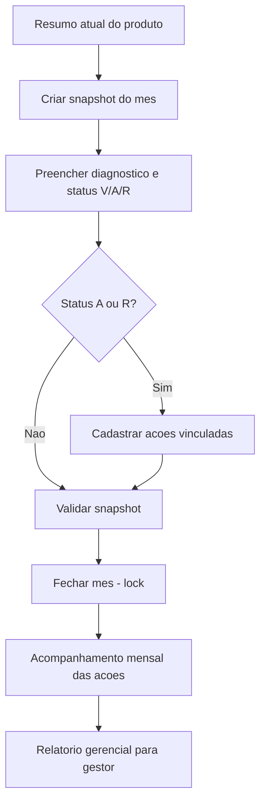

# API Snapshot Mensal de Produto + Plano de Ação – Documentação Frontend

Documento para implementação no frontend da nova feature **Snapshot Mensal de Produto** com **Plano de Ação** vinculado e **Relatório Gerencial** mensal.

---

## 1. Visão geral

A cada mês o gestor registra uma **fotografia do produto** (snapshot) com a situação real e um **status do mês** (Verde/Amarelo/Vermelho). Quando o status indica problema, vincula-se um ou mais **planos de ação** (tipo, descrição, responsável, prazo, impacto, status). Após o fechamento do mês, o snapshot é **travado** (imutável); as ações continuam podendo evoluir até serem concluídas.

| Conceito | Descrição |
|----------|-----------|
| **Snapshot Mensal** | 1 por produto por mês (`metaProdutoId + ano + mes`). Único. |
| **Status do produto no mês** | `V` (Verde), `A` (Amarelo), `R` (Vermelho). |
| **Fechamento** | Trava os campos analíticos do snapshot. |
| **Reabertura** | Operação dedicada (perfil gestor) que destrava o snapshot. |
| **Ação** | Plano vinculado ao snapshot, com tipo, prazo, responsável, impacto e status. |
| **Relatório Gerencial** | Consolidação mensal por projeto com métricas + ações vencidas + produtos críticos. |

---

## 2. Base URL e autenticação

- **Base URL:** `{API_BASE}/api/produtos-snapshots-mensais`
- **Autenticação:** JWT no header (`Authorization: Bearer <token>`).

---

## 3. Fluxo operacional mensal



Pontos importantes:

1. Antes de criar o snapshot, o frontend pode chamar `GET /api/meta-produtos/resumo?idProduto={id}` para obter as métricas atuais (`ProdutoResumoDTO`).
2. Ao fechar o snapshot, o backend grava `dataFechamento` e `usuarioFechamento` automaticamente.
3. Após o fechamento, **PUT, DELETE e adição de ações ainda funcionam** apenas para a evolução de ações; o **PUT no snapshot é bloqueado** até reabertura.

---

## 4. Endpoints

### 4.1 Listar snapshots (paginado)

`GET /api/produtos-snapshots-mensais`

| Query param | Tipo | Obrigatório | Descrição |
|-------------|------|-------------|-----------|
| `metaProdutoId` | long | Não | Filtra por produto. |
| `ano` | int | Não | Filtra por ano. |
| `mes` | int | Não | Filtra por mês (1..12). |
| `page`, `size`, `sort` | – | Não | Paginação Spring padrão. |

Resposta `200 OK`: `Page<ProdutoSnapshotMensalDTO>`.

### 4.2 Buscar snapshot por ID

`GET /api/produtos-snapshots-mensais/{id}` → `200 OK` com `ProdutoSnapshotMensalDTO`.

### 4.3 Criar snapshot

`POST /api/produtos-snapshots-mensais`

Body (`ProdutoSnapshotMensalCreateDTO`):

| Campo | Tipo | Obrigatório | Regras |
|-------|------|-------------|--------|
| `metaProdutoId` | long | Sim | Produto existente. |
| `ano` | int | Sim | 1900..3000. |
| `mes` | int | Sim | 1..12. |
| `statusProdutoMes` | enum | Sim | `V`, `A` ou `R`. |
| `situacao` | string | Não | Máx. 255. Se omitido o backend usa `situacao` do resumo atual. |
| `valorTotalOrcamento` | number | Não | >= 0. Se omitido, captura do resumo atual. |
| `valorTotalEmExecucao` | number | Não | >= 0. |
| `valorTotalExecutado` | number | Não | >= 0. |
| `percentualExecucao` | number | Não | >= 0. |
| `valorMediaEntregaPrevistaMensal` | number | Não | >= 0. |
| `valorMediaEntregaRealMensal` | number | Não | >= 0. |
| `resumoAnalitico` | text | Não | Diagnóstico do mês. |

Erros principais:
- `400` – validação ou snapshot duplicado para `(metaProdutoId, ano, mes)`.
- `404` – produto inexistente.

Resposta `201 Created` com `ProdutoSnapshotMensalDTO`.

### 4.4 Atualizar snapshot (parcial)

`PUT /api/produtos-snapshots-mensais/{id}` (somente quando `fechado = false`).

Body (`ProdutoSnapshotMensalUpdateDTO`): todos os campos opcionais — apenas valores enviados são alterados. **Não permite trocar `metaProdutoId/ano/mes`.**

Erros:
- `400` – snapshot fechado.
- `404` – snapshot inexistente.

### 4.5 Excluir snapshot

`DELETE /api/produtos-snapshots-mensais/{id}` → `204 No Content`.

Regras:
- Snapshot **fechado** não pode ser excluído (reabra antes).
- Snapshot **com ações** vinculadas não pode ser excluído.

### 4.6 Fechar / Reabrir snapshot

| Método | Rota | Descrição |
|--------|------|-----------|
| `POST` | `/api/produtos-snapshots-mensais/{id}/fechar` | Trava o snapshot. Grava `dataFechamento` + `usuarioFechamento`. |
| `POST` | `/api/produtos-snapshots-mensais/{id}/reabrir` | Destrava o snapshot. Limpa `dataFechamento` e `usuarioFechamento`. |

Retornam `200 OK` com o `ProdutoSnapshotMensalDTO` atualizado.

### 4.7 Ações do snapshot

| Método | Rota | Descrição |
|--------|------|-----------|
| `GET` | `/api/produtos-snapshots-mensais/{snapshotId}/acoes` | Lista as ações do snapshot (ordenadas por prazo asc). |
| `POST` | `/api/produtos-snapshots-mensais/{snapshotId}/acoes` | Cria uma nova ação. |
| `PUT` | `/api/produtos-snapshots-mensais/{snapshotId}/acoes/{acaoId}` | Edita campos gerais da ação (sem mudar status). |
| `PUT` | `/api/produtos-snapshots-mensais/{snapshotId}/acoes/{acaoId}/status` | Evolui o status da ação (timestamp `dataStatus`). |
| `DELETE` | `/api/produtos-snapshots-mensais/{snapshotId}/acoes/{acaoId}` | Remove a ação. |

Body do `POST` (`ProdutoSnapshotAcaoCreateDTO`):

| Campo | Tipo | Obrigatório | Regras |
|-------|------|-------------|--------|
| `tipoAcao` | enum | Sim | `PREVENTIVA`, `CORRETIVA`, `CONTINGENCIA`. |
| `descricao` | text | Sim | Não vazio. |
| `responsavelId` | long | Não | ID de um `Usuario` existente. |
| `responsavelNome` | string | Não | Máx. 255. Use quando responsável for externo. |
| `prazo` | string (ISO date) | Sim | `YYYY-MM-DD`. |
| `impacto` | enum | Sim | `B`, `M`, `A`. |
| `statusAcao` | enum | Não | Default `ABERTA`. |
| `observacaoStatus` | text | Não | – |

Body do `PUT /status` (`ProdutoSnapshotAcaoUpdateStatusDTO`):

```json
{ "statusAcao": "EM_ANDAMENTO", "observacaoStatus": "Aguardando aprovação" }
```

Status disponíveis: `ABERTA`, `EM_ANDAMENTO`, `CONCLUIDA`, `CANCELADA`.

### 4.8 Relatório gerencial

`GET /api/produtos-snapshots-mensais/relatorio-gestor?ano={ano}&mes={mes}&projetoId={opcional}`

Resposta `200 OK` com `ProdutoSnapshotRelatorioGestorDTO`:

```ts
interface ProdutoSnapshotRelatorioGestorDTO {
  ano: number;
  mes: number;
  projetoId?: number | null;
  resumo: ProdutoSnapshotRelatorioGestorResumoDTO;
  produtos: ProdutoSnapshotRelatorioGestorItemDTO[];
  acoesVencidas: ProdutoSnapshotAcaoDTO[];
  produtosCriticos: ProdutoSnapshotRelatorioGestorItemDTO[];
}
```

O campo `produtosCriticos` é uma sublista de `produtos` priorizada para destaque (status `R`, ou `A` com ações vencidas).

---

## 5. DTOs – Referência rápida (TypeScript)

```ts
type StatusProdutoMes = "V" | "A" | "R";
type TipoAcaoProduto = "PREVENTIVA" | "CORRETIVA" | "CONTINGENCIA";
type ImpactoAcao = "B" | "M" | "A";
type StatusAcaoProduto = "ABERTA" | "EM_ANDAMENTO" | "CONCLUIDA" | "CANCELADA";

interface ProdutoSnapshotMensalDTO {
  id: number;
  metaProdutoId: number;
  metaProduto?: MetaProdutoDTO;
  ano: number;
  mes: number;
  statusProdutoMes: StatusProdutoMes;
  situacao?: string | null;
  valorTotalOrcamento?: number | null;
  valorTotalEmExecucao?: number | null;
  valorTotalExecutado?: number | null;
  percentualExecucao?: number | null;
  valorMediaEntregaPrevistaMensal?: number | null;
  valorMediaEntregaRealMensal?: number | null;
  resumoAnalitico?: string | null;
  fechado: boolean;
  dataFechamento?: string | null;
  usuarioFechamentoId?: number | null;
  usuarioFechamentoNome?: string | null;
  dataRegistro: string;
  dataUpdate: string;
}

interface ProdutoSnapshotAcaoDTO {
  id: number;
  snapshotId: number;
  tipoAcao: TipoAcaoProduto;
  descricao: string;
  responsavelId?: number | null;
  responsavelNome?: string | null;
  prazo: string; // YYYY-MM-DD
  impacto: ImpactoAcao;
  statusAcao: StatusAcaoProduto;
  dataStatus: string;
  observacaoStatus?: string | null;
  dataCriacao: string;
  dataUpdate: string;
}

interface ProdutoSnapshotRelatorioGestorItemDTO {
  snapshotId: number;
  metaProdutoId: number;
  codigoProduto: string;
  nomeProduto: string;
  projetoMetaId: number;
  codigoMeta: string;
  nomeMeta: string;
  projetoId: number;
  nomeProjeto: string;
  ano: number;
  mes: number;
  statusProdutoMes: StatusProdutoMes;
  fechado: boolean;
  percentualExecucao?: number | null;
  valorTotalOrcamento?: number | null;
  valorTotalEmExecucao?: number | null;
  valorTotalExecutado?: number | null;
  totalAcoes: number;
  acoesAbertas: number;
  acoesEmAndamento: number;
  acoesConcluidas: number;
  acoesCanceladas: number;
  acoesVencidas: number;
  acoesImpactoAlto: number;
}

interface ProdutoSnapshotRelatorioGestorResumoDTO {
  totalProdutos: number;
  produtosVerde: number;
  produtosAmarelo: number;
  produtosVermelho: number;
  snapshotsFechados: number;
  snapshotsAbertos: number;
  totalAcoes: number;
  acoesAbertas: number;
  acoesEmAndamento: number;
  acoesConcluidas: number;
  acoesCanceladas: number;
  acoesVencidas: number;
  acoesImpactoAlto: number;
  somaValorTotalExecutado: number;
  somaValorTotalOrcamento: number;
  percentualExecucaoConsolidado: number;
}
```

---

## 6. Exemplos

### 6.1 Criação de snapshot

```bash
POST /api/produtos-snapshots-mensais
{
  "metaProdutoId": 12,
  "ano": 2026,
  "mes": 4,
  "statusProdutoMes": "A",
  "situacao": "Atraso de fornecedor",
  "resumoAnalitico": "Atraso de 15 dias na entrega do componente X"
}
```

Resposta `201`:

```json
{
  "id": 30,
  "metaProdutoId": 12,
  "ano": 2026,
  "mes": 4,
  "statusProdutoMes": "A",
  "situacao": "Atraso de fornecedor",
  "valorTotalOrcamento": 540000.00,
  "valorTotalEmExecucao": 120000.00,
  "valorTotalExecutado": 230000.00,
  "percentualExecucao": 42.59,
  "valorMediaEntregaPrevistaMensal": 45000.00,
  "valorMediaEntregaRealMensal": 38000.00,
  "resumoAnalitico": "Atraso de 15 dias na entrega do componente X",
  "fechado": false,
  "dataRegistro": "2026-04-30T18:21:35"
}
```

### 6.2 Cadastro de ação

```bash
POST /api/produtos-snapshots-mensais/30/acoes
{
  "tipoAcao": "CORRETIVA",
  "descricao": "Renegociar prazo com fornecedor X",
  "responsavelId": 7,
  "prazo": "2026-05-15",
  "impacto": "A"
}
```

### 6.3 Evolução de status da ação

```bash
PUT /api/produtos-snapshots-mensais/30/acoes/115/status
{
  "statusAcao": "EM_ANDAMENTO",
  "observacaoStatus": "Reunião marcada para 05/05"
}
```

### 6.4 Fechar mês

```bash
POST /api/produtos-snapshots-mensais/30/fechar
```

A partir daqui, qualquer `PUT` no snapshot retorna `400`. Ações continuam editáveis.

---

## 7. Regras de negócio

1. **Único por produto/mês**: tentativa de criar duplicado retorna `400`.
2. **Lock no fechamento**: snapshot fechado bloqueia `PUT` (apenas `POST .../reabrir` libera).
3. **Auditoria de fechamento**: `dataFechamento` e `usuarioFechamento` (extraído do JWT) gravados ao fechar; limpos ao reabrir.
4. **Ações vinculadas a snapshot**: criar/atualizar/excluir ação **independe** do estado de fechamento.
5. **Exclusão segura**: snapshot só pode ser excluído quando aberto e sem ações.
6. **Métricas**: na criação, valores não informados são preenchidos pelo backend a partir do resumo atual do produto.
7. **Relatório gerencial**: ações vencidas consideram `prazo < hoje` e status em `ABERTA` ou `EM_ANDAMENTO`.

---

## 8. Códigos HTTP

| Código | Uso |
|--------|-----|
| 200 | GET, PUT, fechar, reabrir – sucesso. |
| 201 | POST – snapshot ou ação criada. |
| 204 | DELETE – sucesso. |
| 400 | Validação, regra (lock, duplicado, exclusão com ações). |
| 401 | Token ausente/inválido. |
| 404 | Snapshot, produto, ação ou usuário inexistente. |
| 500 | Erro inesperado. |

---

## 9. Sugestões de UX no frontend

1. **Lista mensal por projeto** – usar `relatorio-gestor` como tela inicial mensal, com cards por status (V/A/R) e filtro por projeto.
2. **Tela do produto-mês** – exibir métricas do snapshot ao lado do resumo atual (`ProdutoResumoDTO`) para comparação histórica.
3. **Ações em destaque** – sinalizar visualmente ações com `prazo < hoje` e status ativo.
4. **Confirmar fechamento** – modal explicando que o snapshot ficará travado e indicando como reabrir, se aplicável.
5. **Dashboard gerencial** – usar o `resumo` do relatório (totais V/A/R, ações vencidas, % consolidado) para o painel principal do gestor.
6. **Exportação** – considerar gerar PDF/Excel a partir do `ProdutoSnapshotRelatorioGestorDTO` para envio ao gestor da empresa.

---

Documento alinhado ao backend (entidades `ProdutoSnapshotMensal` e `ProdutoSnapshotAcao`, controller, service, DTOs e migration `V15`). Em caso de dúvida, consultar `controller/ProdutoSnapshotMensalController`, `service/ProdutoSnapshotMensalService` e `dto/ProdutoSnapshot*`.
